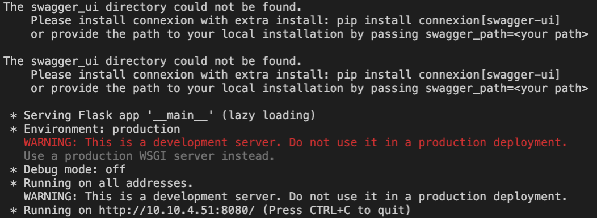
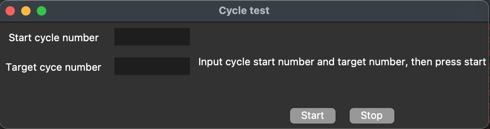

# Cycle Test Microservice

## Requirements
In order to run the software properly, please make sure you have the following:
1. Python 3.7+

## Installation
1. Install all python libraries. Go to the `app-cycle-test/` folder and run:
```
pip3 install -r requirements.txt
```

## Usage
You will need to run a server that connects to the GPIO port and a GUI
### Running the server
1. Open up a terminal and go to the `app-cycle-test/` folder. Run:
```
python3 -m server
```
You should be able to see the terminal print out something like this:


### Running thr GUI
1. Open up another terminal, go to the `app-cycle-test/` folder. Run:
```
python3 cycle_test_gui.py
```

You should see the GUI like this that popsup:


Now you're ready to run the test.

## Starting the test
1. Type in the "Start cycle number" and "Target cycle number"
2. Press "Start"

## Stopping the test
1. At any point in the test, if you need to stop, simply press the stop button and the test will stop after it finishes the cycle. 

## Closing the software
When you are finished, you can simply close the terminals. Or you can press `Ctrl+C` to terminate the program it is running. 